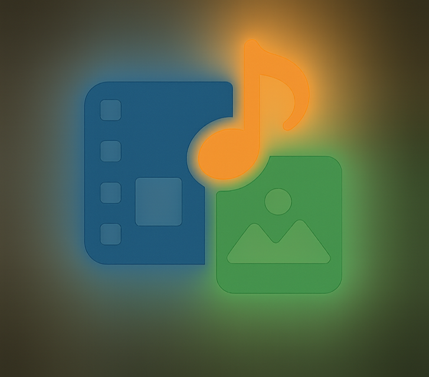
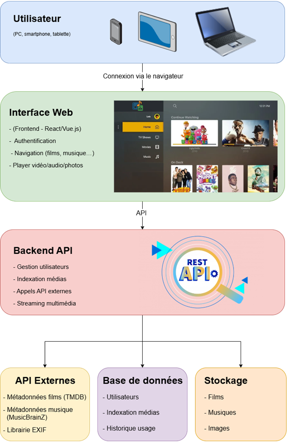

# 🎬 Plateforme multimédia auto-hébergée (SAÉ 5.01)

> Application web conteneurisée qui lit **films, séries, musiques et photos** depuis un NAS/dossier local, avec **authentification** et **indexation automatique** (affiches, synopsis, EXIF). Projet pédagogique BUT R&T.  
> Basé sur le cahier des charges du 28/09/2025. :contentReference[oaicite:3]{index=3}

<p align="center">
  
</p>

---

## 📖 Description

- Lecture **vidéo/audio** (player HTML5) et **galerie photos** (tri via métadonnées **EXIF**).  
- Récupération des **métadonnées** via des indexeurs externes (ex. TMDB, MusicBrainz).  
- **Interface web sécurisée** avec authentification.  
- **Déploiement Docker** pour portabilité et simplicité (NAS ou serveur local). :contentReference[oaicite:4]{index=4}

---

## 🧩 Architecture

<p align="center">
  
</p>

**Blocs principaux :**
- **Frontend** (React/Vue) : UI, auth, navigation, players.  
- **Backend API** (Node/Python) : auth, indexation, appels API externes, streaming.  
- **Base de données** (SQLite/MySQL) : utilisateurs, index, historique.  
- **Stockage** (NAS/FS) : vidéos, musiques, photos (EXIF).  
- **Indexeurs** : TMDB, MusicBrainz, librairie EXIF. :contentReference[oaicite:5]{index=5}

---

## 🚀 Démarrage rapide (Docker)

### 1) Prérequis
- Docker & Docker Compose installés  
- Un dossier de médias (lecture au minimum)

### 2) Variables d’environnement
Créez un fichier `.env` à la racine (basé sur `docker/env.example` si présent) :

#### Réseau & ports

APP_PORT=8080

#### Volumes

MEDIA_DIR=/chemin/vers/medias

#### Clés API (à obtenir)

TMDB_API_KEY=xxx
MUSICBRAINZ_APP_NAME=MonApp/1.0.0 (contact@exemple.com
)

#### Auth

JWT_SECRET=change_me


### 3) Exemple `docker-compose.yml` minimal
> Placez-le dans `docker/docker-compose.yml` ou à la racine selon votre préférence.

```yaml
services:
  backend:
    build: ./backend
    env_file: .env
    volumes:
      - "${MEDIA_DIR}:/app/media:ro"
    ports:
      - "${APP_PORT}:8080"
    depends_on:
      - db

  frontend:
    build: ./frontend
    environment:
      - VITE_API_URL=http://localhost:${APP_PORT}
    ports:
      - "5173:5173"

  db:
    image: mysql:8
    environment:
      - MYSQL_DATABASE=media
      - MYSQL_ROOT_PASSWORD=root
    volumes:
      - db_data:/var/lib/mysql

volumes:
  db_data:

### 4) Lancer

docker compose up --build
Frontend dev : http://localhost:5173
API/Backend : http://localhost:${APP_PORT}

## 🧪 Tests à prévoir

Scan & indexation du dossier médias (films/séries/musiques/photos)

Authentification multi-utilisateurs

Streaming fluide depuis NAS / FS

Compatibilité navigateurs (Chrome, Firefox, Edge, mobile)

Performance (cache métadonnées, pagination)

## 👥 Organisation (groupe de 3)

A — Backend + API : auth, gestion médias, streaming.

B — Frontend Web : interface, navigation, player.

C — Intégration & DevOps : Docker, NAS, doc, tests.

Planning jalonné (MVP backend → MVP frontend → intégration Docker → indexeurs TMDB/MusicBrainz/EXIF → finalisation & rapport → démo).

## 📚 Documentation & livrables

docs/

cahier_des_charges.pdf (version rendue)

presentation/Pitch_SAE501_4min.pptx

img/

logo.png

schema_global.png (schéma global)

Le CDC couvre : contexte/enjeux, objectifs, tâches (conception, dev, intégration, validation/doc), planning.

## 🔗 Ressources mobilisées

Cours/compétences : Docker, dev web, HTTP/streaming, BDD & API.

APIs : TMDB (films/séries), MusicBrainz (musique), EXIF (photos).

Encadrants : M. Beysson (référent), M. Kromenacker (réseaux).

## 🤝 Contribution
Kinan HALABI, Vladimir MELTSOV, Lois GENAY
